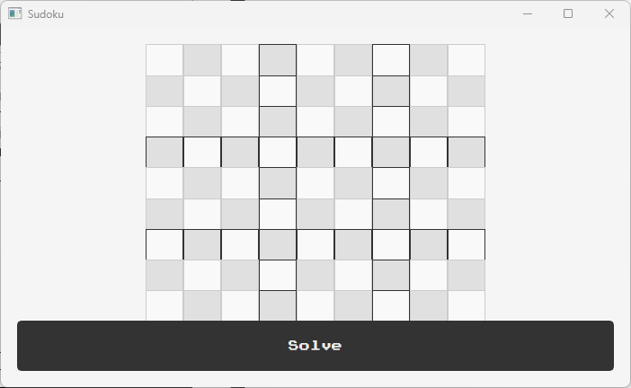
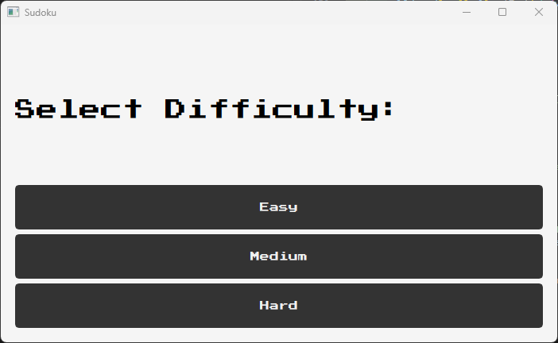

# Sudoku Solver

This repository contains a project developed for the (CSE351) Introduction to Artificial Intelligence course. The goal is to implement a Sudoku solver using Constraint Satisfaction Problem (CSP) techniques, with a focus on **Arc Consistency**.

## Table of Contents

- [Game Description](#game-description)
- [Features](#features)
- [Prerequisites](#prerequisites)
- [How to Run](#how-to-run)
- [Board Generation](#board-generation)
- [Arc Consistency](#arc-consistency)
- [Walkthrough and Graphical User Interface](#walkthrough-and-graphical-user-interface)

---

## Game Description

Sudoku is a logic-based number-placement game that challenges players to fill a 9x9 grid with digits from 1 to 9. The objective is to complete the grid in such a way that each row, each column, and each of the nine 3x3 subgrids (also known as regions or boxes) contains all of the digits from 1 to 9 without repetition.

---

## Features

### Game Modes
1. **Mode 1**: Watch the AI agent solve a randomly generated Sudoku puzzle.
    - Interactive board where users can fill cells and get real-time feedback on constraint violations.
2. **Mode 2**: Input your own Sudoku puzzle and let the AI agent solve it.

### Data Structures and Algorithms

#### Algorithms

- **Backtracking**:
  - A systematic trial-and-error approach used to fill the puzzle grid.
  - Starts by selecting an empty cell and trying all possible numbers (1-9) that satisfy the Sudoku rules.
  - If a number violates the rules, the algorithm "backtracks" by undoing the last assignment and trying the next possibility.
  - Recursively repeated until the entire grid is filled or no solution exists.
  - Ensures all potential solutions are explored efficiently, leveraging heuristics like choosing the most constrained cells first to speed up the search.

- **Minimum Remaining Values (MRV)**:
  - A heuristic used to improve the efficiency of backtracking by selecting the variable (a Sudoku cell) with the fewest legal values left in its domain.
  - By prioritizing the most constrained variable, MRV reduces the likelihood of making invalid assignments early and helps detect dead ends sooner, thereby pruning the search space effectively.

- **Least Constraining Values (LCV)**:
  - A heuristic used to decide the order in which values from the domain of a variable should be tried, prioritizing values that impose the fewest constraints on other unassigned variables.
  - It selects a number that minimizes restrictions on the possible values of other cells, increasing the chances of finding a valid solution as the algorithm progresses.

- **Arc Consistency**:
  - Represent Sudoku as a CSP with:
    - Variables: Each cell.
    - Domains: Possible values for each cell (1–9).
    - Constraints: No number repetition in rows, columns, and subgrids.
  - Enforce arc consistency by revising variable domains.

#### Data Structures

- **Sudoku Board**: Two-Dimensional List
- **For Arc Consistency**:
  - **domains (dictionary)**: Represents the possible values (domains) for each cell on the Sudoku board. Keys are tuples (r, c) indicating row and column positions, and values are sets containing possible numbers {1, 2, ..., 9}.
  - **arcs (list of tuples)**: Contains pairs of cell coordinates representing constraints or relationships between those cells. Arcs ensure consistency by enforcing that connected cells do not share the same value when it's not allowed.
  - **deque (double-ended queue)**: Used to store and process arcs efficiently. The deque is used for breadth-first processing, where arcs are added and removed from both ends as needed.
  - **set (used for domains and neighbors)**: Helps manage unique values efficiently. It's used for representing possible values of cells and storing neighbors without duplicates.

---

## Prerequisites

- Python3.
- PyQt5 library for GUI and AI.
- "Press Start 2P" font (for the best gaming experience)

---

## How to Run

1. Clone the repository:
   ```bash
   git clone https://github.com/Mohamed-code-13/ai-sudoku-solver.git
   cd ai-sudoku-solver
   ```
2. Run the code: Ensure you have Python installed and execute the following to start the program.
   ```bash
   main.py
   ```
3. Follow the on-screen instructions to choose a game mode.

---

## Board Generation

The technique used to generate the sudoku puzzles involves generating a valid sudoku puzzle, then randomly removing n tiles from the generated puzzle, where n is determined by the level of difficulty.
The valid sudoku puzzle is first generated using backtracking with randomness, which makes it possible to generate random sudoku puzzles, rather than using deterministic backtracking, which, if used, would always generate the same initial sudoku puzzle.
- “Easy” difficulty: 30 tiles are removed, meaning that 51 tiles are set initially.
- “Medium” difficulty: 40 tiles are removed, setting 41 tiles to be displayed initially.
- “Hard” difficulty: only 31 tiles are set, meaning that 50 tiles are removed.

<div style="display: flex; justify-content: space-around; align-items: center; text-align: center;">
  <div>
    
    <p><em>Figure 1 - "Easy" Puzzle</em></p>
  </div>
  <div>
    
    <p><em>Figure 2 - "Medium" Puzzle</em></p>
  </div>
  <div>
    
    <p><em>Figure 3 - "Hard" Puzzle</em></p>
  </div>
</div>

---

## Arc Consistency

Arc Consistency is displayed in a file named `domain.txt`, which is saved in the same directory as the `main.py` file.
The file is divided into steps, each step consisting of lines, each representing the domain of a cell before and after enforcing arc consistency.

#### Sample File:
  ```bash
    Step 2:
    Cell (0, 1): Before: [1, 6, 8] -> After: [1, 8]
    Cell (1, 1): Before: [1, 3, 4, 6, 8] -> After: [1, 3, 4, 8]
    Cell (2, 1): Before: [4, 6] -> After: [6]

    Step 3:
    Cell (0, 1): Before: [1, 8] -> After: [1]

    Step 4:
    Cell (0, 4): Before: [3, 5, 6, 7] -> After: [3, 6, 7]
    Cell (1, 4): Before: [3, 4, 5, 6, 7] -> After: [3, 4, 6, 7]
    Cell (3, 4): Before: [3, 5] -> After: [5]

    Step 5:
    Cell (0, 4): Before: [3, 6, 7] -> After: [6]

    Step 6:
    Cell (1, 2): Before: [3, 4, 8, 9] -> After: [3, 4, 9]
    Cell (3, 1): Before: [1, 3, 7, 8] -> After: [1, 3, 7]
    Cell (3, 2): Before: [3, 7, 8] -> After: [8]
   ```

---

## Walkthrough and Graphical User Interface
<div style="float: right; margin-left: 20px; text-align: center;">
  
  <p><em>Figure 4 - Main Menu Window</em></p>
  
  <p><em>Figure 5 - Game Mode Menu</em></p>
</div>

When the main.py file is run initially, the player is met with the Main Menu window. After the user clicks on the “Play” button, the user is met with the Game Mode window, where the player can choose either to generate random sudoku puzzles, or enter their own puzzle.

If the player decides to enter their own puzzle, they click on the “User Input” button, and they are then met with an empty board, where they can click on a tile, and enter a value from 1 to 9. After setting up the board, the user clicks on the “Solve” button, which first checks its solvability, and either displays an error message in a `QMessageBox`, or solves it and displays the solved puzzle.

<div style="float: left; margin-right: 20px; text-align: center;">
  
  <p><em>Figure 6 - Empty Puzzle for User Input</em></p>
  
  <p><em>Figure 7 - Input for tile (5,5)</em></p>
</div>

If the player wants a random sudoku puzzle, they click on the “Random Board” button. This displays the difficulty options, which are three buttons labelled “Easy”, “Medium”, and “Hard”. After clicking on the desired difficulty, the user is met with the Game Window, which consists of a `QHBoxLayout` holding the sudoku puzzle on the left, and the game controls on the right.

Clicking on the “Reset” button generates an entirely new board of the same chosen difficulty and displaying it on the board. The “Solve” button checks first if the given puzzle is solvable, and if so, displays the solved puzzle and shows the result on the board.

The player also has the option to click on an empty tile and enter a value. If the value is not part of the result, an error message is displayed in a `QMessageBox`, and the value is rejected. If the user enters a correct value, it is displayed on the board, and the board is solved with the new tile in place.

<div style="display: flex; justify-content: space-around; align-items: center; text-align: center;">
  <div>
    
    <p><em>Figure 8 - Select Difficulty Menu</em></p>
  </div>
  <div>
    
    <p><em>Figure 9 - Randomly Generated "Hard" Puzzle</em></p>
  </div>
</div>
<div style="display: flex; flex-direction: column; align-items: center; justify-content: center; text-align: center;">
    
    <p><em>Figure 10 - Solved Puzzle</em></p>
</div>

---
